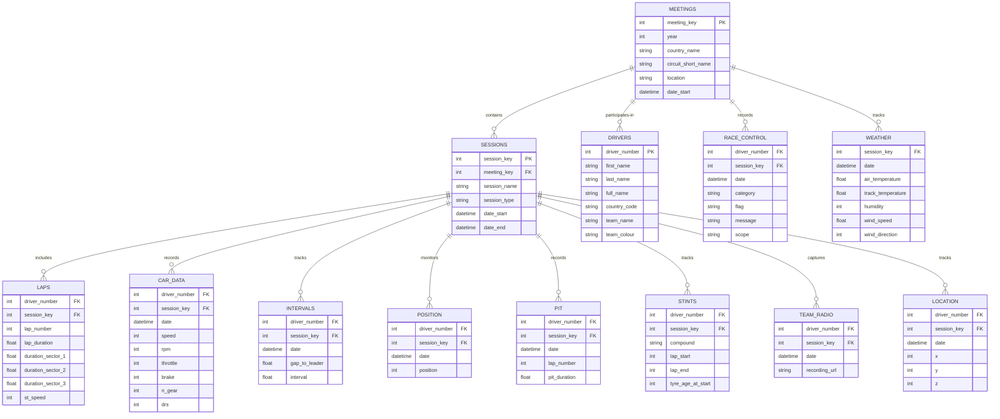

# 🏎️  F1 Insights: Real-Time Replay & Historical Analytics 🏁

# 📖 Project Overview
Click below image or this link for a video Overview 👇 ▶️ 

Project overview explanation Link: [Click Here ](https://vimeo.com/1038211767)

[](https://vimeo.com/1038211767)

--------------------------------------------------------------
Click below image or this link for a dashboard Overview 👇 ▶️ 

Dashboards explanation Link: [Click Here](https://vimeo.com/1038203523)

[](https://vimeo.com/1038203523)


A real-time Formula 1 telemetry system and historical data analysis system that captures, processes, and visualizes car data during race sessions, enabling both live replay and historical analysis.

The project involves a two fold analysis approach

- Realtime Race replay - To replay how the Race would pan out, and dive deep into what and how things changed that led to an outcome. (Would work during the race as well :) )
- Historical analysis - To answer important questions which involves post race analysis, about how weather impacts the outcome, tyre choices , race strategies and pit strategies

The system serves two primary analytical purposes:


### Real-Time Race Replay

 

Using live telemetry data, the system reconstructs race sessions in real-time, allowing viewers to experience the race as it unfolds. This feature provides deep insights into crucial moments by visualizing:

- Driver performance through speed, throttle, and brake data
- Strategic DRS (Drag Reduction System) usage
- Gear selection patterns across different track sections
- Dynamic position changes and overtaking maneuvers

### Historical Analysis & Strategic Insights

Beyond real-time replay, the system enables comprehensive post-race analysis to understand the intricate factors that influence race outcomes:

- Weather impact on tire degradation and pit stop timing
- Effectiveness of different pit strategies across varying track conditions
- Analysis of tire compound choices and their influence on race pace

By combining real-time telemetry with historical data, this platform serves as both an engaging visualization tool and a powerful analytical resource for understanding the technical and strategic elements that define Formula 1 racing.

# Motivation

Formula 1 racing represents the pinnacle of motorsport technology, where split-second decisions and minute performance differences determine victory. This project presents a comprehensive Formula 1 telemetry analysis system that brings together real-time data streaming and historical insights to unlock the complexities of race strategy and performance.

This has been a passion project of mine since long and i hope to keep improving and deploying it down the line for anyone to use and make sense of what factors led to the Race outcome


# Project Scope

- The project comprises 3 major sections  :
    - Real-time Streaming Pipeline using Confluent Kafka, SingleStore , AWS ec2 deployment
    - Historical Trend Analysis using DBT , Snowflake , Airflow (WAP maintaining idempodency)
    - Grafana (Interactive visualizations and deep dive)

## Dataset Choices

- For the most part i came across multiple data sources that help
    
    
    | Data_source | Data_source_type | Cost | Longevity | Support and community | Advantages |
    | --- | --- | --- | --- | --- | --- |
    | [Fast-F1](https://github.com/theOehrly/Fast-F1/tree/master?tab=readme-ov-file) | Python / pandas-based | Free | Din’t offer a robust API | 2.5k stars on github | 
    • Implements caching for all API requests to speed up your scripts |
    | [Ergast](http://ergast.com/mrd/) | REST-API | Free | will be [Depricated](http://ergast.com/mrd/limit-parameter-restriction/) (End of 2024) |  | Been around for a while, quite relaible with the data |
    | [OpenF1](https://openf1.org/?python#pit) | open-source API | Free | Quite active (as of today) | 368 stars |  |
    | [SportMonks](https://my.sportmonks.com/subscriptions/create/sport/2/plans) | API | Paid (65 euros/month) | Reliable | -  | Accurate well maintained and can be banked on  |
    
    My choice was OpenF1 for the following reasons:
    
    - The API is directly sourced from [F1 LiveTiming](https://www.formula1.com/en/timing/) , So in future after i subscribe the data json would look similar and i can directly source from the official site
    - Offers multiple data in depth with different API endpoints. essentially 1 API with multiple API endpoints that give different data (High frequency data and low frequency generic info)
    - Had structure and relationships between endpoints, that would let me correlate the effect of one over the other

## High level Architecture Diagram


## Technology choices:

### Real-time Streaming Pipeline

The real-time component leverages 

Confluent Kafka hosted on AWS EC2, paired with SingleStore as our operational database. This architecture was chosen for several compelling reasons:

- **Confluent Kafka** serves as our message broker because it excels at handling high-throughput, real-time data streams with minimal latency.
  
    - Formula 1 telemetry generates thousands of data points per second across multiple cars especially the telemetry metrics like speed , throttle metrics, and Kafka's publish-subscribe model perfectly suits this use case.
    - The platform's robust partitioning and fault tolerance ensure we never miss critical race data. Four topics in my producer that is consumed by singlestore pipelines
    
      
    
    ## **SingleStore**
    
    **SingleStore** was selected as our operational database due to its unique ability to handle both real-time data ingestion and analytical queries simultaneously. Its columnar storage format and vector processing capabilities make it ideal for processing time-series telemetry data while maintaining sub-second query response times for our dashboards. Serving as both OLTP and OLAP database in one, which can perform high fidelity data ingests, analysis over millions of rows with ms latency  
    Process Flow:

    

    
    
## **AWS EC2** ( t3.micro )

- It has a Flask listener that does the following
    - Listens via port 5000  →  /run-and-redirect url (Triggered from Grafana Cloud dashboard )→ calls a Python (Producer) script with necessary parameters  →  redirects to my Grafana ec2 deployment
              
         ```python
                
                app = Flask(__name__)
                
                @app.route('/run-and-redirect', methods=['GET'])
                def run_script():
        
              cmd = [
                  'python3',
                  '/home/ubuntu/kafka_producer_v6_cloud.py',
                  '--param1', start_time,
                  '--param2', end_time,
                  '--session', session,
                  '--data-types', 'car',
                  '--driver', driver
              ]
        
              logger.info(f"Running command: {' '.join(cmd)}")
              subprocess.Popen(cmd)
        
              redirect_url = f'http://<ip_address>:3000/d/f1-telemetry/f1-real-time-telemetry?orgId=1&from={start_time.replace("T", " ")}&to={end_time.replace("T", " ")}&timezone=browser&var-driver={driver}&var-session={session}&refresh=1s'
        
              return redirect(redirect_url)
        
        ..........
        ```

### Historical Trend Analysis

For deeper historical analysis, we implemented a robust data warehouse solution using:

- DBT (Data Build Tool) manages our data transformations, enabling us to create clean, tested, and documented data models. Its version control and modularity allow us to maintain complex racing analytics while ensuring data quality through built-in testing.
    
    
- Snowflake serves as our data warehouse, chosen for its separation of storage and compute resources. This architecture is particularly valuable for F1 analysis, where we might need to process years of historical race data while simultaneously handling real-time queries.
- Apache Airflow orchestrates our ETL workflows using the Write Audit Publish (WAP) pattern to maintain idempotency. This ensures our historical analysis remains accurate and reproducible, even when processing data from multiple racing seasons.

### Interactive Visualization

Grafana ties our entire solution together through interactive dashboards that serve both real-time and historical analysis needs. We chose Grafana for its:

- Ability to handle real-time data streams with  refresh rates as low as 1s
- Support for complex time-series visualizations essential for race telemetry
- Flexible query builders that work seamlessly with both SingleStore and Snowflake

## API responses converted into Tables (ERD)



The processes have the following stages of data architecture:

## Data Ingestion

 

I made sure during my ingestion these 5 properties are always maintained

### Idempodency ( Merge keys )

- No two non-unique recods are added to the table also ensuring upserts only
- Created a dynamic since the structure of the statement remains same
    
        
        
    

## API call retires and Fallbacks

- So API’s are unreliable sometimes, hence having retry feature to make sure, no data is left behind during ingest
    
      
    
- Handling high frequency data
    - For telemetry high frequency data, i broke my api calls into 5 min chunks
    - Let’s say the API still produces too much data to handle, then it fallback into 1/2 the window size and then continues to maintain 5 min windows for the next call
        
      
        

## Always ingest into a temp staging table

- Made sure the production table is not impacted by ingestion issues (always ingesting to a staging table and dropping it immediately after succesful merge)
    
     
    

## Compute resources ( save costs)

- There is no Race every single day so i made sure i don’t exhaust the compute resources on a non race day
    
    
  
    

## Data Transformation

These are all my data transformations

- Anything prefixed with stg are my staging models.
- Prefixed with “f1_” are my data marts and used in final dashboards
- Prefixed with “int_” are my intermediate models used a lot in multiple marts as well
    
    
  
    

My Transformations on a high level include:

### Staging models ( Pulled from tested source  table ):

`dbt_project/models/staging`

- Things like (Changing datatype and names of my columns)
    - Changing datatype and names of my columns
        - `driver_number::VARCHAR(50) as driver_number,`
        - `TO_TIMESTAMP_NTZ(date) as timestamp,`
        - `NULLIF(gap_to_leader, 'None') as gap_to_leader`
        - `DATEADD(second, lap_duration, DATE_TRUNC('second', date_start)) AS date_end,`
    - Adding columns for time ranges
        - `DATE_TRUNC('second', date_start) AS date_start,`
    
    ### Intermediate models ( Pulled from tested staging  models and other int_models alone ): few example below
    
    `dbt_project/models/intermediate`
    
    - Weather (Computing averages and Categorizing my dashboards)
        
       
      
        
    - Computing lap wise start and end positions
        
        
        
        ## Marts (`dbt_project/models/marts`)
        
        Used directly in dashboards
        
        - There were only position changes , so i had to fill positions for the laps where there was no position change , to understand how the position evolved
            
            
          
            
        - A mart for dashboard filters as well
            
            
            
    

## Data Validation


- Added generic tests:
    
    ```sql
    
    
    with validation as (
        select
            {{ column_name }} as field_value
        from {{ model }}
        where {{ column_name }} is not null  -- Only test non-null values
    ),
    
    validation_errors as (
        select
            field_value
        from validation
        where field_value < {{ min_value }} or field_value > {{ max_value }}
    )
    
    select *
    from validation_errors
    
    
    ```
    
- More specific tests as well
    
    ```sql
    -- Add this to macros/f1_car_data_tests.sql
    
    
    with high_values as (
        select
            date,
            brake,
            throttle,
            speed,
            rpm
        from {{ model }}
        where brake > 105  -- Allowing for some sensor overflow
          and throttle > 105  -- Allowing for some sensor overflow
          -- Only flagging when both brake and throttle are extremely high
          -- and when we're not at very low speeds (could be valid during starts/pit exits)
          and speed > 50
          -- Excluding engine warmup/testing scenarios
          and rpm > 5000
    ),
    
    -- Look for sustained periods of extreme values
    sustained_issues as (
        select *,
            lead(date) over (order by date) as next_reading,
            lag(date) over (order by date) as prev_reading
        from high_values
    )
    
    -- Return only the problematic readings that persist for multiple samples
    select
        date,
        brake,
        throttle,
        speed,
        rpm
    from sustained_issues
    where datediff('millisecond', prev_reading, date) < 500  -- Looking for sustained issues
       or datediff('millisecond', date, next_reading) < 500
    
    ```


# Data Visualization
### Historical Dashboards:

## F1 (LAP on LAP analysis)


- How do gaps between drivers evolve during the race?
- Compare race pace vs qualifying pace per sector for a driver ?
- How does sector performance  affect position changes ?
- How do pit-out laps affect overall race strategy?

## F1 Telemetry Analysis (Historical)


- How do drivers use DRS throughout the race?
- How do braking patterns differ between drivers?
- How does speed, throttle, drs patterns differ between multiple drivers
    
## F1 Tyre preference and weather impact


- What's the optimal tire life for each compound at different circuits?
- How do different teams manage their tire strategies?
- How does track temperature affect tire strategy?
- What's the correlation between humidity and wet conditions effect tire performance?

## Realtime Dashboard

 

- Realtime replay of specific portion of the race
    - Drivers race dashboard , showing speed, braking and drs in realtime
    - Realtime view of your favourite driver
    - Works during the race as well

## Challenges and FAQs

Why Grafana on EC2? 

- Grafana does not support 1s natively on cloud it can go as low as 5s refresh , whats the fun if there is no 1s refresh in Formula 1 , hence i deployed my grafana instance changes min_refresh_interval in my grafana.ini file , hosted on the instance

Why Two Grafana’s (Deployed on Ec2 and Grafana cloud)

- I wanted to keep the historical data containing millions of rows in Grafana Cloud, easy cloud snowflake connection , sharing and fast and realible, can make as many filters and changes since it’s just a connection to Snowflake
- Grafana Ec2 to achieve 1s latency and then connect Grafana cloud button to redirect to my Grafana on Ec2

Why SingleStore pipelines ?

- Extremely fast ingest
- Has a shared Tier free forever
- ms latency allowing me perform hig fedility queries in my Grafana dashboards

How does Snowflake dbt and airflow fit in the workflow ? 

- All of trend analysis, tyre considerations, lap on lap position change, driver riding patterns (Anything that requires a lot of historical data to view holistically)
    
